# 🎙️ GMM-Based Language & Speaker Identification System

**Design, Implementation, and Performance Evaluation**


---

## 📌 Project Overview

This repository presents a **high-performance system for Language Identification (LID)** and **Speaker Identification / Verification (SID)**. The system relies on **Gaussian Mixture Models (GMM)** combined with **MFCC acoustic features** to classify speech signals across multiple languages and to verify speaker identities with high precision.

The project is designed with a **research-oriented mindset**, emphasizing statistical modeling, rigorous evaluation, and reproducibility, while remaining fully usable as a standalone application.

---

## 🌟 Key Features

* **Multilingual Language Identification**
  Supports **French, English, Dutch, Darija (Moroccan Arabic), and Japanese** using statistical acoustic modeling.

* **Hybrid Silence Removal (Key Contribution)**
  A robust algorithm combining **K-Means**, **GMM-based energy modeling**, and **energy thresholding** to preserve speech integrity while effectively suppressing noise.

* **GMM Optimization Study**
  Extensive evaluation of **4 → 512 Gaussian components**, analyzing the trade-off between **accuracy** and **computational cost**.

* **Segment-Length Analysis**
  Systematic testing on **5s, 10s, and 15s** segments to evaluate robustness against short utterances.

* **End-to-End Application**
  Audio → Identification → Transcription → Translation → **Speech Synthesis (TTS)**.

---

## 🧠 System Architecture

The system is organized around **three main subsystems**, forming a complete speech-processing pipeline:

* **Language Identification (LID)**: determines the spoken language from an audio signal.
* **Speaker Identification / Verification (SID)**: recognizes or verifies the speaker’s identity.
* **Final Application**: integrates identification, transcription, translation, and speech synthesis.

```mermaid
graph LR
    A[Audio Input] --> B[Hybrid Silence Removal]
    B --> C[MFCC Feature Extraction]
    C --> D[GMM Modeling / EM Algorithm]
    D --> E{Decision Logic}
    E --> F[Language Identification]
    E --> G[Speaker Verification]
    F --> H[ASR → Translation → TTS]
```



The final stage allows **message reduction, translation, and generation of a synthesized speech signal in the target language**, enabling full understanding of the original spoken content.

---

## 📊 Experimental Results

### 🔤 Language Identification

* **Darija & Dutch**: nearly **100% recognition** from 32 Gaussians
* **English ↔ French**: strong confusion due to phonetic proximity
* **Japanese**: lower accuracy, often confused with French

➡️ Increasing the number of Gaussians **does not always improve performance**. A **moderate complexity (32 GMMs)** offers the best compromise between robustness and generalization.

### 🗣️ Speaker Verification (Biometric Evaluation)

The verification protocol relies on **log-likelihood scores** and a **variable decision threshold (θ)**:

* **FAR (False Acceptance Rate)**: impostors incorrectly accepted
* **FRR (False Rejection Rate)**: genuine speakers incorrectly rejected
* **EER (Equal Error Rate)**: point where FAR = FRR

**Best configuration**:

| Metric            | Value      |
| ----------------- | ---------- |
| Model             | GMM-256    |
| Training Duration | 1 minute   |
| Test Segment      | 10 seconds |
| EER               | **5.4%**   |
| Reliability       | **94.6%**  |

DET curves show a **strong separation** between genuine and impostor score distributions, confirming high discriminative power.

------|--------|
| Optimal Model | GMM-256 |
| Minimum Training Data | 60 seconds |
| Equal Error Rate (EER) | 5.4% |
| Overall Reliability | 94.6% |

---

## 🛠️ Installation & Setup

### Prerequisites

* **Python 3.9+**
* **FFmpeg** (required for audio preprocessing)

### Installation

```bash
# Clone the repository
git clone https://github.com/yourusername/GMM-Speech-System.git
cd GMM-Speech-System

# Install dependencies
pip install -r requirements.txt
```

### Requirements

```text
numpy
librosa
scikit-learn
speech_recognition
gTTS
pyttsx3
matplotlib
pandas
```

---

## 🚀 Usage

### 1️⃣ Training

Train language and speaker models with configurable GMM complexity:

```bash
python scripts/train_all.py --data ./data/train --gaussians 32
```

### 2️⃣ Application Interface

The GUI follows a **four-step pipeline**:

1. **Audio Loading** → Hybrid silence removal
2. **Identification** → Language / Speaker via GMM scores
3. **Transcription & Translation** → Speech-to-text + MT
4. **Speech Synthesis** → Vocal output in the target language

```bash
python App.py
```

### 3️⃣ Evaluation

```bash
python scripts/evaluate.py --test_dir ./data/test
```

---

## 📁 Project Structure

```bash
.
PROJECT_FINAL/
├── projet_langue/ # Application-oriented: Language Identification
│ ├── All_Gaussians/ # GMMs with varying number of components (comparative study)
│ ├── data/ # Language datasets (train/test)
│ ├── trained_models/ # Optimal GMMs selected via BIC
│ ├── App.py # Main application (GUI / end-user interface)
│ ├── matrice_confusion.ipynb # Confusion matrix analysis (Language ID)
│ ├── script.ipynb # Training and evaluation scripts
│ ├── speaker.ipynb # Auxiliary experiments
│ ├── output.png # Sample identification output
│ ├── outputmatrice.png # Global confusion matrix
│ ├── outputmatrice10s.png # Confusion matrix (10s segments)
│ └── outputmatrice15s.png # Confusion matrix (15s segments)
│
├── projet_locuteur/ # Research-only: Speaker Verification methodology
│ ├── dataset_loc_preparé/ # Prepared speaker datasets
│ ├── locloc/ # Intermediate experimental data
│ ├── trained_models_per_person/ # Speaker-dependent GMMs
│ ├── speaker.ipynb # FAR / FRR / EER / DET analysis
│ ├── detlocuteur.png # DET curve (speaker verification)
│ ├── outputfarvsfrr.png # FAR vs FRR curves
│ └── top10.png # Top-10 score distribution analysis
│
├── .gitattributes
├── .gitignore
└── README.md
```

---

## 🔬 Methodology Summary (For Academic Review)

This project follows a **rigorous experimental methodology**, aligned with standard practices in statistical speech processing and biometric evaluation.

### 1️⃣ Data Preparation

* Audio signals are stored in **WAV format** and organized by **language** and **speaker**.
* Datasets are split into **training** and **test** subsets to ensure unbiased evaluation.
* For speaker experiments, audio is segmented into **1-minute and 2-minute** training samples, while test segments are fixed to **5s, 10s, and 15s**.

### 2️⃣ Preprocessing & Silence Removal (Hybrid Threshold)

A **hybrid silence removal algorithm** is applied prior to feature extraction:

* **K-Means** clustering on short-term energy
* **GMM modeling** of energy distributions
* **Adaptive hybrid threshold** combining both approaches

This method:

* Preserves speech continuity (avoids word truncation)
* Reduces background noise effectively
* Outperforms standalone K-Means or GMM thresholds

➡️ Experimental comparisons show that the hybrid threshold yields the **most stable MFCC trajectories**, especially for female voices.

### 3️⃣ Feature Extraction

* **MFCC (13 coefficients)** extracted using a **Hamming window**
* Delta coefficients added to capture **temporal dynamics**
* Frame-level features aggregated per utterance

### 4️⃣ Statistical Modeling

* One **GMM per language** (LID) and **one GMM per speaker** (SID)
* EM algorithm used for parameter estimation
* Number of Gaussians varied from **4 to 512**

### 5️⃣ Model Selection

* **Bayesian Information Criterion (BIC)** used to select optimal models
* Prevents overfitting by penalizing excessive complexity
* Optimal configurations stored in `trained_models/`

---

## 📈 Experimental Studies & Figures

This section summarizes the **main experimental studies** conducted during the project. Detailed plots are available in the `notebooks/` directory.

### 🔢 Study 1: Number of Gaussian Components (BIC Analysis)

**Objective**: Determine the optimal GMM complexity.

* Tested values: **4, 8, 16, 32, 64, 128, 256, 512**
* Evaluation metric: **BIC score**

📌 **Observation**:

* BIC decreases with model complexity up to a point
* A minimum is reached around **32–64 Gaussians** for language ID
* Higher values increase computation without consistent gains


📊 *Figure*: BIC score vs. number of Gaussians (Men + Women combined)

---

### ⏱️ Study 2: Impact of Test Segment Length

**Objective**: Evaluate robustness against short utterances.

* Segment lengths: **5s, 10s, 15s**

📌 **Observation**:

* 5s segments show higher variance and lower accuracy
* 10s segments offer a strong balance between latency and reliability
* 15s segments provide marginal improvements

📊 *Figure*: Accuracy vs. segment length

---

### 🧩 Study 3: Confusion Matrix Analysis (Language ID)

Confusion matrices highlight **inter-language confusions**:

* **Darija & Dutch**: near-perfect recognition
* **English ↔ French**: strong bidirectional confusion
* **Japanese**: often confused with French

📌 **Key Insight**:
Increasing GMM components does **not** systematically improve results. A **moderate model (32 GMMs)** is more robust.


📊 *Figure*: Confusion matrices for 5s matrice


📊 *Figure*: Confusion matrices for 10s matrice


📊 *Figure*: Confusion matrices for 15s matrice
---

🗣️ Study 4: Speaker Verification (DET & EER)

This study evaluates the speaker verification subsystem using standard biometric evaluation protocols, with a strong emphasis on methodological consistency, automation, and rigorous performance analysis.

Importantly, this section relies on the same codebase, feature extraction pipeline, and preprocessing logic used for language and gender identification, ensuring full technical coherence across the project.

1️⃣ Processing Logic and Dataset Preparation

The speaker verification pipeline is fully automated and operates at the speaker level (F1, F2, M1, etc.). Each speaker is modeled independently using Gaussian Mixture Models.

Feature Extraction

Extraction of 13 MFCC coefficients using a Hamming window to characterize the unique vocal tract signature of each individual.

Addition of Delta coefficients to capture temporal dynamics of speech.

Frame-level features are retained only after hybrid silence removal.

Hybrid Silence Removal

Silence and non-speech segments are eliminated using a hybrid energy-based approach:

K-Means clustering on short-term energy

GMM modeling of energy distributions

Adaptive threshold selection combining both methods

This ensures that silence is removed exactly as in the original study, preserving speech integrity while reducing noise.

2️⃣ Training Dataset Automation

For each speaker, the system automatically generates multiple training configurations by varying two key parameters:

Training duration: 1 minute or 2 minutes

GMM complexity: 32, 64, 128, and 256 components

Training Logic

Audio files are concatenated per speaker.

The first 60 or 120 seconds are selected depending on availability.

A verification step ensures sufficient audio length before model training.

Each configuration results in a trained GMM saved under a structured directory hierarchy:

./trained_models_per_person/Amina/Amina_1min_32.gmm

This systematic storage enables direct and fair comparison between models of different complexities.

3️⃣ Test Dataset Generation

To ensure standardized evaluation, the test dataset is generated automatically:

30 test segments per speaker

Segment durations: 5s, 10s, and 15s

Intelligent step (overlap) computation distributes segments across the full audio length

Each segment is exported as a .wav file and stored in test_segments/ using consistent naming conventions. This guarantees a balanced and diverse test set for robust evaluation.

4️⃣ Score Computation (Log-Likelihood)

For each test segment, a log-likelihood score is computed against every speaker model:

High (less negative or positive) scores indicate strong correspondence with the model.

Low (highly negative) scores indicate mismatch.

This results in two distinct score distributions:

Target (Client) scores: test speaker matches the model (hypothesis H₀)

Impostor (Non-target) scores: test speaker differs from the model (hypothesis H₁)

5️⃣ Decision Threshold and Error Metrics

A variable decision threshold (θ) governs acceptance or rejection:

If score > θ → identity accepted

If score < θ → identity rejected

By sweeping θ across the full score range, we compute:

FAR (False Acceptance Rate): impostors incorrectly accepted (security risk)

FAR(θ) = Number of impostor scores ≥ θ / Total number of impostor trials

FRR (False Rejection Rate): genuine speakers incorrectly rejected (usability loss)

FRR(θ) = Number of rejected client tests / Total number of client tests

The Equal Error Rate (EER) corresponds to the operating point where FAR = FRR.

6️⃣ Experimental Results and Best Configuration

📌 Best-performing configuration:

Model: GMM-256

Training duration: 1 minute per speaker

Test duration: 10 seconds

Equal Error Rate (EER): ≈ 5.4%

System reliability: ≈ 94.6%

This configuration provides the optimal trade-off between discrimination performance and computational efficiency.

7️⃣ DET and EER Curve Analysis

FAR vs. FRR curves illustrate the inverse relationship between security and accessibility.

The DET curve (logarithmic scale) remains close to the axes, demonstrating strong separation between target and impostor score distributions.

The intersection of FAR and FRR curves clearly identifies the EER operating point.

📈 Figures:


Comparison of DET curves for top-performing configurations


EER visualization for the optimal GMM-256 model
